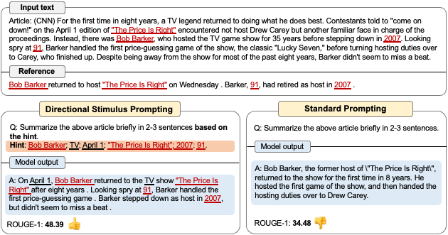
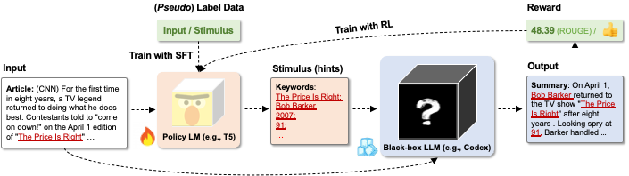

# 💡DSP: Directional-Stimulus-Prompting

**Directional-Stimulus-Prompting** is a framework that uses a tuneable language model (LM) to provide guidance for the black-box frozen large language model (LLM) towards desirable properties. Specifically, we train a policy LM to generate discrete tokens as *directional stimulus* of each input, which is a hint/cue such as keywords of an article for summarization. The *directional stimulus* is then combined with the original input and fed into the LLM to guide its generation toward the desired target (an example can be seen in **Figure 1**). 

<p align="center">
  
</p>
<p align="left">
  <b>Figure 1:</b> Comparison of our proposed Directional Stimulus Prompting with the standard prompting method to use the LLM such as GPT-3 on the summarization task. Our DSP uses a tuneable policy LM to generate the stimulus (highlighted in orange color), which is keywords in this case, to guide the LLM on generating the desired summary (highlighted in blue color) with higher rouge scores or other measures like human preference. 
</p>

The policy LM can be trained through (1) `supervised finetuning from annotated data (SFT)` and (2) `reinforcement learning from offline and online rewards (RL)` to explore directional stimulus that better aligns LLMs with human preferences. This framework is flexibly applicable to various LMs and tasks. An illustration of the **DSP** framework is shown in **Figure 2**.

Paper Link: https://arxiv.org/abs/2302.11520

<p align="center">
  
</p>
<p align="left">
  <b>Figure 2:</b> Overview of our proposed framework DSP, which learns a small policy LM to improve the frozen LLM's performance on specific downstream tasks. Given the input, the policy LM generates stimulus to guide the LLM's generation, which is then evaluated with downstream performance measures or human labelers. The evaluation scores are used as rewards to optimize the policy LM with RL. The parameters of LLM are frozen while the policy LM is tuneable.
</p>

Currently, we test the framework on two benchmark tasks: 
 - Summarization
 - Dialogue Generation

Our code is based on [RL4LMs](https://github.com/allenai/RL4LMs). Users can customize the dataset, metrics, and LLM-based reward function to train transformer-based policy LMs, to provide guidance for the LLMs towards the desirable properties.


---
# Install

## Local Installation 
```bash
git clone https://github.com/leezekun/Directional-Stimulus-Prompting.git
cd Directional-Stimulus-Prompting
pip install -e .
```

## Docker
We provide also a Dockerfile for development using docker containers containing all the dependencies.
```bash
docker build . -t dsp
```

## Additional dependencies

Optionally, coreNLP libraries are required for certain metric computations (eg. SPICE) which can be downloaded through `cd rl4lms/envs/text_generation/caption_metrics/spice && bash get_stanford_models.sh`

## Setup OPENAI ACCESS KEY
You should setup your openai access key to call the api. 
`export OPENAI_API_KEY='XXXXXXXX'`


---
# Step 1: Supervised Fine Tuning (SFT)
First, we perform supervised finetuning (SFT) on the policy LM with annotated data to provide a good initial point for the further RL training. The code and data are placed in the `sft4lms` directory. We provide the script to run the SFT for the two tasks:
```bash
sh run_sft_cnndm.sh # for the summarization task on the CNN/Daily Mail dataset
sh run_sft_multiwoz.sh # for the dialogue generation task on the MultiWOZ dataset
```

---
# Step 2: RL Training with PPO/NLPO
This part is based on [RL4LMs](https://github.com/allenai/RL4LMs). A simple training API that can be invoked via train [script](https://github.com/allenai/RL4LMs/blob/main/scripts/training/train_text_generation.py) that allows to train PPO, NLPO or a supervised model by using a config file (YAML). 

We provide the scripts of training the policy LM T5 on the tasks of summarization and dialogue generation. You can run the scripts:
```bash
sh run_ppo_cnndm.sh
sh run_ppo_multiwoz.sh
```

The config files for the summarization and dialogue generation tasks can be found in the `scripts/training/task_configs/summarization_with_hint` and `scripts/training/task_configs/multiwoz_with_hint`, respectively.
You can customize the configuration files as instructed in [RL4LMs](https://github.com/allenai/RL4LMs).

## YAML file schema - Configuring building blocks

Config file contains details about hyper-parameter settings for building blocks which are described below:

- **Dataset/Task**: Dataset containing samples with input prompts and reference sentences. Available datasets are found in the class `DataPoolRegistry` in [registry](https://github.com/allenai/RL4LMs/blob/main/rl4lms/envs/text_generation/registry.py). (See how to create your own dataset [here](#adding-dataset)) 
For our experiments, we customize the datasets of CNN/Daily Mail and MultiWOZ, which are registered as `cnn_daily_mail_with_hint` and `multiwoz_with_hint`:

  ```yaml
  datapool:
    id: cnn_daily_mail_with_hint
    args:
      prompt_prefix: "Extract the keywords: "
      n_train: 2000
      n_val: 500
      n_test: 500
      extraction_mode: "textrank"
      extraction_source: "all"
  ```
  ```yaml
  datapool:
    id: multiwoz_with_hint
    args:
      version: "2.0"
      n_train: 80
      n_val: 100
      n_test: 1000
  ```

- **Reward Function**: Reward function which computes token-level scores at each time step of MDP. Available reward functions can be found in the class `RewardFunctionRegistry`. (See how to create your own reward function [here](#adding-reward-function)) We customize the LLM-based reward functions, where the reward is measured on the generation of LLMs guided by stimulus generated by the trained policy LM.


  ```yaml
  reward_fn:
  id: summarization_with_hint
  args:
    gpt3_model: 'gpt-3.5-turbo' 
    interval: 0.5 # arguments for exponential backoff
    timeout: 20.0
    exp: 2.0
    patience: 10
    temperature: 0.7 # arguments for the LLM's inference
    max_tokens: 128
    num_seqs: 4
    top_p: 1.0
    stop_words: ["Article:", "Q:",  "A:", "<|im_end|>"]
    selection_strategy: "choose_all" # average all the inferences generated by the LLM
    prompt_prefix: "Extract the keywords: "
    prompt_path: "./prompts/cnn_fs.txt"
    hint_prompt_path: "./prompts/cnn_hint_fs.txt"
    gpt3_metric: "rouge-avg" # metric on the generation of the LLM
    gpt3_coef: 10.
    use_baseline: False
    t5_coef: 0.
    t5_metric: "hint_hit" # the customized metric on the keywords generated by the policy LM (t5)
    t5_pos_coef: 1.0
    t5_neg_coef: 0.25 # penalty for the policy LM (t5) if generated a ``wrong'' keyword
    step_reward_coef: 1.0 # set as 0 if not use step reward
    split_token: ";" # we use ";" to split multiple keywords
    split_token_id: 117 # token id of ";" for t5
  ```
  
Note that we conducted the experiments using Codex (**gpt-3.5-turbo**), which has not been supported by OPENAI since March 23rd, 2023. However, you can [apply for either the Codex model access or a research subsidy](https://openai.com/form/researcher-access-program).
You can also try other models by changing the `gpt3_model`.

- **Environment**: Configures a gym-style text generation [environment](https://github.com/allenai/RL4LMs/blob/main/rl4lms/envs/text_generation/env.py) which simulates MDP episodes. Rollouts are generated using train samples from dataset consisting of input and reference texts.
Further, we wrap our env with `SubProcVecEnv` from stable-baselines that processes `n_envs` episodes in parallel using multi-processing to compute step-wise rewards.  
Further configuration settings include: 
  - `max_episode_length` : max length of the episode 
  - `max_prompt_length` - maximum length of the input text to consider 
  - `terminate_on_eos` - whether to terminate the episode as soon as EOS action is performed 
  - `prompt_truncation_side` - truncation side for the prompt text 
  - `context_start_token` - id for context token (corresponds to initial token given to decoder in encoder-decoder models)

  ```yaml
  env:
    n_envs: 10
    args:
      max_prompt_length: 512
      max_episode_length: 100
      terminate_on_eos: True
      prompt_truncation_side: "right"
      context_start_token: 0
  ```

- **On-policy alg**: We provide implementations of 4 on-policy algorithms: PPO, NLPO, A2C and TRPO adapted from [stable-baselines3](https://github.com/DLR-RM/stable-baselines3) tailored to work with NLP tasks which can be used out-of-the-box with either a causal policy or a seq2seq LM policy. (See how to create your own [on-policy algorithm](#adding-custom-on-policy-algorithms) or [policy](#adding-custom-policies))
  - We also provide a supervised [trainer](https://github.com/allenai/RL4LMs/blob/2863116cd5860e4a4106a76486e70bfac25df2ba/rl4lms/envs/text_generation/training_utils.py#L225) for benchmarking purposes. Supervised Warm start models are already uploaded to Huggingface Hub and specified in the respective config files.
  - Hyper-parameters for the algorithm can be specified at `alg/args`. 
  - Further, all RL algorithms use adaptive KL controller to keep the LM close to original LM by setting initial KL co-efficient (`alg/kl_div/coeff`) and target KL (`alg/kl_div/target_kl`). 
  - We support two types of LM policy: **causal LM policy** (for decoder only models) and **seq2seq LM policy** (for encoder-decoder models). Further for NLPO, we also provide maskable variants of these. Policy implementations can be found [here](https://github.com/allenai/RL4LMs/blob/main/rl4lms/envs/text_generation/policy.py) in and it can be attached to algorithms by specifying `alg/policy/id` and `alg/policy/args`

    ```yaml
    alg:
      id: nlpo
      args: 
        n_steps: 512
        batch_size: 1
        verbose: 1
        learning_rate: 0.000002
        n_epochs: 5
        ent_coef: 0.0
        vf_coef: 0.5
      kl_div:
        coeff: 0.005
        target_kl: 0.5
      policy:
        id: maskable_seq2seq_lm_actor_critic_policy
        args:
          model_name: $MODEL_PATH # the initial checkpoint of the policy LM, use t5-base or the checkpoints trained with SFT in the first step
          apply_model_parallel: True
          prompt_truncation_side: "right"
          min_tokens_to_keep: 100
          top_mask: 0.9
          mask_type: "learned_top_p"
          target_update_iterations: 20
          generation_kwargs:
            min_length: 8
            max_new_tokens: 64
            do_sample: True
            top_k: 100         
    ```

- **Trainer Config**: We provide an [On-policy trainer](https://github.com/allenai/RL4LMs/blob/2863116cd5860e4a4106a76486e70bfac25df2ba/rl4lms/envs/text_generation/training_utils.py#L126) - a feature-complete wrapper that instantiates building blocks from their corresponding configs and provides an outer training loop consisting of *train* and *eval* iterations `train_evaluation/n_iters`. 
  - Each iteration corresponds to performing updates with `alg/args/n_steps` x `env/n_envs` of the chosen algorithm. 
  - For every `eval_every` iters, LM is evaluated on validation split using metrics listed in `train_evaluation/metrics` with generation kwargs provided in `train_evaluation/generation_kwargs` (this overrides rollout `alg/policy/generation_kwargs` for inference purposes only)

  We customize the evaluation function, which measures on the generation of the LLM and the trained policy LM T5.

  ```yaml
  # train and evaluation
  train_evaluation:
    eval_batch_size: 10
    n_iters: 20
    eval_every: 2
    save_every: 2
    metrics:
      - id: summarization_with_hint
        args: 
          gpt3_model: 'gpt-3.5-turbo'
          interval: 0.5
          timeout: 20.0
          exp: 2
          patience: 10
          temperature: 0.7
          max_tokens: 128
          num_seqs: 3
          top_p: 1.0
          stop_words: ["Article:", "Q:",  "A:"]
          selection_strategy: "choose_all"
          split_token: ";"
          split_token_id: 117 # token id of t5 for ";"
          prompt_prefix: "Extract the keywords: "
          prompt_path: "./prompts/cnn_fs.txt"
          hint_prompt_path: "./prompts/cnn_hint_fs.txt"
          use_lower_baseline: False
          use_upper_baseline: False
          gpt3_metrics: 
            - id: meteor
              args: {}
            - id: rouge
              args: 
                use_single_ref: False
            - id: bleu
              args: {}
            - id: bert_score
              args:
                language: en
          t5_metrics: 
            - id: "hint_hit"
              args: 
                split: ";"
    generation_kwargs: # for the trained policy LM T5
      min_length: 8
      max_new_tokens: 64
      do_sample: True
      top_k: 0
      temperature: 0.7
  ```

---
# Custom Building Blocks :wrench:
RL4LMs provide complete customizability - with respect to adding new tasks/datasets, reward functions, evaluation metric, on-policy algorithms and actor-critic policies.

## Adding dataset
Users can create their own datasets by sub-classing [TextGenPool](https://github.com/allenai/RL4LMs/blob/af5a1326578789856ca8550cb5496c9ccc1afdc5/rl4lms/data_pools/text_generation_pool.py#L15) just by overriding `prepare(cls, split: str, **args) -> 'TextGenPool':` method to return an instance of TextGenPool. An example is shown below:


 ```python
 from rl4lms.data_pools.text_generation_pool import Sample, TextGenPool

 class MyDataPool(TextGenPool):
    @classmethod
    def prepare(cls, split: str):
        .. 
        samples = []
        for ix, item in enumerate(..):
            sample = Sample(id=f"{split}_{ix}",
                            prompt_or_input_text=item["document"],
                            references=[item["target"]]
                            )
            samples.append(sample)
        pool_instance = cls(samples)
        return pool_instance

```

## Adding reward function
Custom reward funtions can be implemented easily by sub-classing [RewardFunction](https://github.com/allenai/RL4LMs/blob/af5a1326578789856ca8550cb5496c9ccc1afdc5/rl4lms/envs/text_generation/reward.py#L12) (a callable) which takes observation ($s$), next observation ($s'$), action ($a$), done (indicating whether episode is finished) and meta info (containing other information about textual input). Here, [Observation](https://github.com/allenai/RL4LMs/blob/af5a1326578789856ca8550cb5496c9ccc1afdc5/rl4lms/envs/text_generation/observation.py#L11) is a data class object consisting of generated text (at a particular step), prompt text, context text (at that step), reference text which can be used to compute token-level or sentence level rewards.


 ```python
from rl4lms.envs.text_generation.observation import Observation
from rl4lms.envs.text_generation.reward import RewardFunction


class MyRewardFunction(RewardFunction):
    def __init__(self, *args) -> None:
        super().__init__()

    def __call__(self, prev_observation: Observation,
                 action: int,
                 current_observation: Observation,
                 done: bool,
                 meta_info: Dict[str, Any] = None) -> float:
        if done:
            reward = ..
            return reward
        return 0
 ```

:bulb:
In addition to traditional NLG metrics, for quick prototyping, we provide two synthetic reward functions which trains LMs to [generate numbers](https://github.com/allenai/RL4LMs/blob/af5a1326578789856ca8550cb5496c9ccc1afdc5/rl4lms/envs/text_generation/test_reward.py#L8) in increasing order and [generate dates](https://github.com/allenai/RL4LMs/blob/af5a1326578789856ca8550cb5496c9ccc1afdc5/rl4lms/envs/text_generation/test_reward.py#L54). These can be used to quickly test different algorithms and policies. Corresponding configs can be found here ([numbers](https://github.com/allenai/RL4LMs/tree/main/scripts/training/task_configs/synthetic_generate_increasing_numbers), [dates](https://github.com/allenai/RL4LMs/tree/main/scripts/training/task_configs/synthetic_generate_dates))


## Adding custom metrics
Users can create their own evaluation metric which then will be used to periodically evaluate the model on validation split of dataset. This can be done by sub-classing [BaseMetric](https://github.com/allenai/RL4LMs/blob/af5a1326578789856ca8550cb5496c9ccc1afdc5/rl4lms/envs/text_generation/metric.py#L20) which takes prompt texts, generated texts, reference texts, meta_infos, current LM model, split name as inputs and returns a dict with metric name as key and value consisting of tuple of sentence-level scores and corpus level scores. An example is as follows:

 ```python

from rl4lms.envs.text_generation.metric import BaseMetric

class MyMetric(BaseMetric):
    def __init__(self) -> None:
        super().__init__()

    def compute(self,
                prompt_texts: List[str],
                generated_texts: List[str],
                reference_texts: List[List[str]],
                meta_infos: List[Dict[str, Any]] = None,
                model: PreTrainedModel = None,
                split_name: str = None):
        metric_dict = {
            "custom_metrics/my_metric": ([0.4, 0.7, 0.9], 0.7)
        }
        return metric_dict
 ```

## Adding custom on-policy algorithms

In addition to supported on-policy algorithms (PPO, NLPO, A2C,TRPO), users can implement their own on-policy algorithms with ease by sub-classing stable-baselines3's [OnPolicyAlgorithm](https://github.com/DLR-RM/stable-baselines3/blob/a697401e032dd4fecbbd4162755ddd707df980d3/stable_baselines3/common/on_policy_algorithm.py#L20). Since we provide [wrappers](https://github.com/allenai/RL4LMs/blob/af5a1326578789856ca8550cb5496c9ccc1afdc5/rl4lms/envs/text_generation/alg_wrappers.py#L67) for on-policy algorithms that handles rollouts using LM policies, environment, computing rewards etc, users just need to implement `train()` method with custom loss functions. 

```python
from stable_baselines3.common.on_policy_algorithm import OnPolicyAlgorithm

class MyOnPolicyAlgorithm(OnPolicyAlgorithm):
    def __init__(**args):
        super().__init__(**args)

    def train(self) -> None:
        # train for n_epochs epochs
        for epoch in range(self.n_epochs):
            # Do a complete pass on the rollout buffer
            for rollout_data in self.rollout_buffer.get(self.batch_size):
              # compute loss
```

## Adding custom policies

We provide LM based actor-critic policy [implementations](https://github.com/allenai/RL4LMs/blob/main/rl4lms/envs/text_generation/policy.py) that wraps causal LM and seq2seq LMs. These can be also extended (for eg: use a different critic architecture) by overriding appropriate methods (eg. `evaluate_actions()`)

## Registry
Finally, just register your custom components by adding them to corresponding [registry](https://github.com/allenai/RL4LMs/blob/main/rl4lms/envs/text_generation/registry.py), after which they can be used directly from configs similar to pre-defined components :wave:

## Crowdsourcing templates

We have provided the crowdsourcing templates we used on mechanical turk, along with example inputs in `scripts/crowdworking_templates`. You might find these a helpful starting point either for evaluating your own model's generations, or for gathering training data for a learned reward function.

---

# Logging and Experiment Results

Additionally, we support WANDB logging and warm-starting of training by storing checkpoints and other training artifacts in a user-specified path. This is especially useful for running preemptible jobs on large, scheduled clusters.

Artifacts include (1) jsonl file containing rollout infos at specified intervals (2) jsonl file containing training infos at specified intervals (3) jsonl file containing validation metrics at specified intervals (4) jsonl file containing test metrics before and after training (5) json file with validation predictions at specified intervals (6) json file with test predictions before and after training (7) trained LM model (8) config json used to run the experiment

Complete usage is as follows:

```bash 
WANDB_API_KEY=<YOUR-WANDB-API-KEY-HERE>  python scripts/training/train_text_generation.py \
--config_path <PATH-TO-CONFIG-FILE> \
--experiment_name <EXPERIMENT-NAME> \
--base_path_to_store_results <PATH-TO-STORE-RESULTS> \
--log_to_wandb
```

---

# Citation

```bibtex
@article{li2023guiding,
  title={Guiding Large Language Models via Directional Stimulus Prompting},
  author={Li, Zekun and Peng, Baolin and He, Pengcheng and Galley, Michel and Gao, Jianfeng and Yan, Xifeng},
  journal={arXiv preprint arXiv:2302.11520},
  year={2023}
}
```

# Acknowledgement?
We thank the authors of [RL4LMs](https://github.com/allenai/RL4LMs) for sharing their code. You can contact Zekun Li (`zekunli@cs.ucsb.edu`), if there are questions related to the code.
